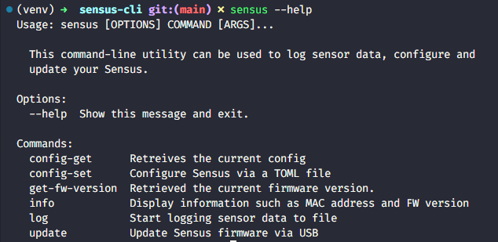

To check out the documentation, please go to: **https://artech.gitbook.io/sensus/**

## How to use this command-line application
This command-line application can be used to update, configure and log data from Sensus. Installing it is as simple as running

```
python3 setup.py install
```

Then, to list the available commands, simply type

```
sensus --help
```



### Updating Sensus
To update the firmware, simply download the latest release from this Github page and then, with Sensus attached, run:

```
sensus update --port <YOUR_SERIAL_PORT> --hex sensus_<version>.hex
```
